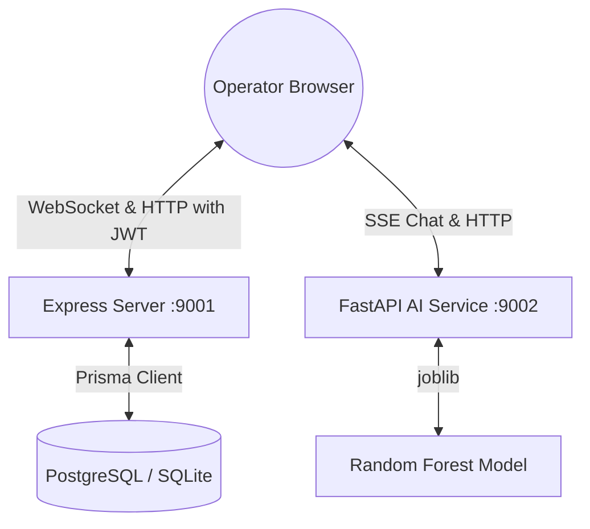

# AeroSync ✈️

**A full-stack, real-time aviation operations and cargo dispatch dashboard.**

AeroSync is an aviation control dashboard built to monitor and orchestrate active flights, coordinate cargo manifests, and simulate disruption cascade events. The platform is designed around a modern multi-tier production architecture: an Express + Socket.IO server utilizing Prisma Client (backed by PostgreSQL in production and local SQLite fallback), a FastAPI AI service running a trained Random Forest model for delay predictions and Server-Sent Events (SSE) chat streaming, and a React frontend styled with custom SpaceX-derived design tokens and animations.

---

## 📐 System Architecture



### Production Architecture (Render Multi-Service Blueprint)
In production, the application is deployed as a multi-service structure:
- **Express Backend**: Connects to a managed Render PostgreSQL database instance via Prisma. Exposes the REST API and Socket.IO server.
- **FastAPI AI Service**: Serves ML delay predictions and SSE streaming AI recovery chat recommendations.
- **Static React Frontend**: Compiled via Vite and served as a high-performance static site (statically routed to the backend and AI microservices).
- **PostgreSQL Database**: Persistent transactional storage for all operational and prediction data.

---

## 🎨 SpaceX Design System

AeroSync is built with a stark, futuristic, terminal-like visual aesthetic inspired by SpaceX crew interfaces. It prioritizes information density, strict layout rules, and clear data visualization.

### Color Tokens
| Token | Value | Usage |
|---|---|---|
| `--bg` | `#000000` | Base page background |
| `--surface` | `#0d0d0d` | Cards, panels, telemetry displays |
| `--border` | `rgba(255,255,255,0.08)` | Hairline grid borders (no drop shadows) |
| `--text-primary` | `#F5F5F5` | Headings, primary metrics, high contrast text |
| `--text-secondary` | `#888888` | Labels, captions, metadata |
| `--text-muted` | `#555555` | Landed/historical flight status |
| `--accent` | `#00D4FF` | Live badges, interactive elements, highlights |
| `--danger` | `#FF4444` | Critical alerts, emergency warnings, delayed flights |
| `--warning` | `#FFB800` | Medium severity alerts, warning indicators |

### Typography & Fonts
- **Display & Headings**: Space Grotesk (weight 600–700, tracking `-0.03em`)
- **Body Text**: Space Grotesk (weight 400)
- **Data, Logs & Telemetry**: JetBrains Mono (weight 400–500)

### Visual Style Rules
- **No Glassmorphism**: Rounded corners must not exceed `4px`. Transparent background blurs are banned.
- **Hairlines**: High-contrast elements are separated by 1px hairline borders (`rgba(255,255,255,0.08)`) instead of box shadows (drop shadows are banned).
- **Theme Constraints**: Flat, stark dark modes are strictly enforced. Decorative gradients and vibrant colors are restricted to active data indicators.

---

## 🚀 Key Features

- **Live Operations Map**: Geospatial tracking via a dark CartoDB Leaflet map, displaying pulsing flight markers, route arcs, and active storm zones.
- **System Metrics HUD**: Displays live active flights, delayed counts, on-time percentage, cargo utilization rates, and the Passenger Impact Counter.
- **Runway Scheduling Board**: A runway timeline display mapping active flight blocks, integrating drag-and-drop slots and AI delay prediction advisories.
- **What-If Sandbox Mode**: Enables operators to enter a scheduling sandbox, adjust slots locally, and view a visual prediction diff before saving.
- **AI War Room**: Interactive recovery chat console side-by-side with a Leaflet map. Streams actionable recovery suggestions word-by-word via FastAPI SSE.
- **Disruption Simulator & D3 Cascade**: Injects operational events (weather, security, equipment) at specific hubs and calculates cascading delays, visualized on a D3 force-directed network graph.
- **Cargo Dispatch Intelligence**: Monitors manifest weights, priority status levels, and capacity limits.

---

## 📂 Project Structure

```text
aerosync/
├── ai-service/          # FastAPI AI Service (Python)
│   ├── models/          # Trained Random Forest model & features
│   ├── main.py          # FastAPI application server (Predict + SSE Chat)
│   ├── test_main.py     # Python pytest suite
│   └── Dockerfile       # Python container configuration
├── backend/             # Express API & WebSocket Server (Node)
│   ├── db/              # Database configuration (Prisma client)
│   ├── middleware/      # Logger, JWT auth, and express-rate-limiters
│   ├── prisma/          # Prisma schema & database seeds
│   ├── routes/          # API Route controllers (flights, cargo, disruptions, auth)
│   ├── sockets/         # Socket.IO connection (hub-scoped room routing)
│   ├── tests/           # API integration tests using native Node test runner
│   ├── server.js        # Express application entrypoint
│   └── Dockerfile       # Node backend container configuration
├── frontend/            # React Client Application (Vite)
│   ├── src/             # Component tree, styles, providers, and state stores
│   ├── vite.config.js   # Vite configuration with chunk-splitting (ports: 9000)
│   └── Dockerfile       # Multi-stage frontend container config (Nginx)
├── docker-compose.yml   # Multi-container local orchestration spec
├── render.yaml          # Render multi-service blueprint deployment configuration
└── package.json         # Workspace configuration and workspace-wide scripts
```

---

## 🔒 Security & API Hardening

- **JWT Authentication**: All mutating routes (`POST`, `PATCH`, `DELETE`) require a valid JWT bearer token. The client automatically signs in using `POST /api/auth/demo-login` on start.
- **Rate Limiting**: The `/api/disruptions/simulate` simulation injector is restricted to 30 requests per minute per IP using `express-rate-limit` to prevent denial-of-service.
- **WebSocket Scoping**: WebSocket updates are routed to hub-specific rooms (`hub:JFK`, `hub:LHR`, etc.). Changing hubs on the frontend automatically switches rooms, preventing unnecessary network traffic.

---

## 📡 API Contracts & Event Specifications

### 1. REST Endpoints (Express Backend - Port 9001)

#### `GET /health`
Verifies server and database connection health.
```json
{
  "status": "ok",
  "db": "ok",
  "ts": "2026-06-19T09:36:55.796Z"
}
```

#### `POST /api/auth/demo-login`
Issues a JWT bearer token for local development.
- **Response**: `{ "token": "jwt-token-here", "user": { "username": "demo", "role": "operator" } }`

#### `GET /api/flights`
Returns all active and scheduled flights.
- **Query Parameters**: `hub` (e.g. `DEL`), `status` (e.g. `delayed`)

#### `PATCH /api/flights/:id`
Updates gate, status, or ETA of a flight. Requires JWT token. Broadcasts to hub-scoped Socket.IO rooms.

#### `POST /api/disruptions/simulate`
Simulates a cascade disruption event at an airport. Requires JWT token. Limited to 30 req/min.

---

### 2. WebSocket Events (Socket.IO Backend - Port 9001)

AeroSync implements room-scoped room updates to reduce packet broadcasts. Clients automatically subscribe to a room named after their active hub (`hub:DEL`, `hub:BOM`, etc.).

#### Client → Server
- `hub:join` (Payload: `string`): Switch active hub room subscription.
- `flight:mutate` (Payload: `{ id: string, gate: string, status: string, estimatedDeparture: string }`): Trigger flight update.

#### Server → Client (Broadcast to Room)
- `flight:updated` (Payload: `{ flightId: string, changes: object }`): Triggered when a flight is updated.
- `disruption:cascade` (Payload: `{ disruptionId: string, affectedFlights: array, cascadeDetails: object }`): Triggered when a disruption cascade event occurs.

---

### 3. REST Endpoints (AI Service - Port 9002)

#### `POST /predict/delay`
Evaluates flight details against the Random Forest ML model or heuristic fallback rules.
- **Request**:
  ```json
  {
    "airline_code": "AI",
    "origin": "DEL",
    "destination": "BOM",
    "day_of_week": 1,
    "departure_time": 1430,
    "flight_length_min": 120,
    "weather_score": 0.8
  }
  ```
- **Response**:
  ```json
  {
    "delay_probability": 0.725,
    "estimated_delay_minutes": 65,
    "confidence": 0.825,
    "reason": "high weather risk (80%) · peak travel day · morning rush slot",
    "model_version": "rf-v1.0"
  }
  ```

#### `POST /chat`
Streams Server-Sent Events (SSE) Markdown recovery suggestions for the AI War Room. Supports OpenAI GPT-4o-mini streaming when configured with an `OPENAI_API_KEY`, otherwise falls back to a deterministic local streaming dispatcher.

---

## 🛠️ Local Setup & Run Guide

To prevent port conflicts with other projects running on ports `3000`, `3001`, or `5173`, local servers are configured to use ports **`9000` (Frontend)**, **`9001` (Backend)**, and **`9002` (AI Service)**.

### Option A: Running with Docker Compose (Recommended)
Launch the entire system (including a local PostgreSQL database container) in one command:
```bash
docker-compose up --build
```
Open [http://localhost:9000/](http://localhost:9000/) to access the live dashboard.

### Option B: Running Bare-Metal Locally

#### Step 1: Install Workspace Dependencies
From the root directory:
```bash
npm install
```

#### Step 2: Initialize Database (SQLite Fallback)
```bash
cd backend
npm install
node prisma-setup.js
npx prisma db push
npx prisma db seed
```

#### Step 3: Run the AI Service (FastAPI)
```bash
cd ../ai-service
pip install -r requirements.txt
python3 -m uvicorn main:app --host 127.0.0.1 --port 9002
```

#### Step 4: Run the Backend Server (Express)
```bash
cd ../backend
PORT=9001 CLIENT_URL=http://localhost:9000 node server.js
```

#### Step 5: Run the Frontend App (Vite React)
```bash
cd ../frontend
cp .env.example .env
npm run dev -- --port 9000
```
Open [http://localhost:9000/](http://localhost:9000/) in your browser.

---

## 🧪 Running Test Suites

- **Backend API integration tests**:
  ```bash
  cd backend && npm run test
  ```
- **AI service pytest suite**:
  ```bash
  cd ai-service && python3 -m pytest
  ```

---

## ☁️ Production Deployment (Render)

AeroSync is fully optimized for one-click multi-service deployment using Render's Blueprint specification (`render.yaml`).

### Setup & Infrastructure
When you deploy this project, Render will automatically provision:
1. **aerosync-db**: A managed PostgreSQL database instance (version 15).
2. **aerosync-backend**: An Express + Socket.IO Node server.
3. **aerosync-ai**: A Python FastAPI machine learning microservice.
4. **aerosync-frontend**: A high-performance static React site served via Vite.

### How it Works (Automated Integration)
- **Database Seeding**: During the backend's build phase (`npm install && node prisma-setup.js`), the build runner automatically pushes the Prisma schema to the newly created PostgreSQL database (`npx prisma db push`) and runs the upsert seeding script (`npm run seed`) so the app is populated with default operational flights and cargo records immediately upon startup.
- **Dynamic Inter-service Routing**: The Blueprint dynamically references the hostnames generated by Render for each service:
  - The static frontend gets built with `VITE_API_URL`, `VITE_WS_URL`, and `VITE_AI_URL` pointing dynamically to the backend and AI hosts.
  - The backend gets built with `CLIENT_URL` pointing dynamically to the frontend host to satisfy CORS policies.
  - The AI service gets built with `BACKEND_URL` pointing to the backend host.
- **AI Model Resiliency**: If deployed on a standard/free instance without the 18MB Random Forest training set or pre-compiled model file (`delay_rf_v1.pkl`), the FastAPI microservice gracefully switches to a deterministic heuristic model based on flight metadata. This prevents `503 Service Unavailable` errors and keeps the prediction feature 100% functional.

### Deploying the Blueprint
1. Connect your GitHub repository to Render.
2. Go to **Blueprints** in your Render Dashboard and click **New Blueprint Instance**.
3. Select your repository.
4. Render will read `render.yaml` and prompt you to approve the services. Click **Apply**.
5. Once deployment is complete, navigate to the URL of the **aerosync-frontend** static site to access your operational dashboard!

---

## 📄 License
MIT


