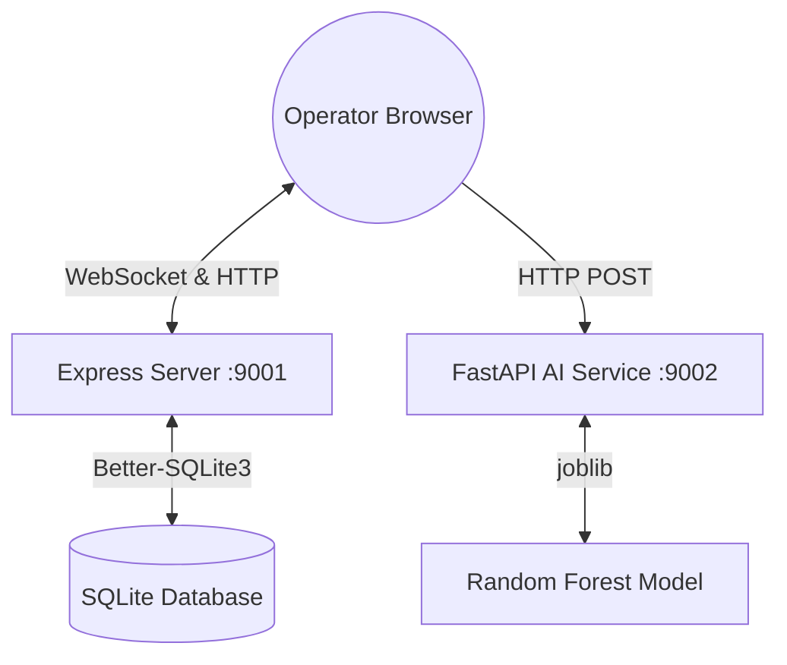

# AeroSync ✈️

**A full-stack, real-time aviation operations and cargo dispatch dashboard.**

AeroSync is an aviation control dashboard built to monitor and orchestrate active flights, coordinate cargo manifests, and simulate disruption cascade events. The platform is designed around a three-tier production architecture: an Express + Socket.IO server backed by a SQLite database with Drizzle ORM, a FastAPI AI service running a trained Random Forest model for delay predictions, and a React frontend styled with custom SpaceX-derived design tokens and animations.

---

## System Architecture



### Production Architecture (Render)
In production, the application runs as a **unified service**:
- The **Express Backend** serves both the REST/WebSocket API and the built static assets of the **React Frontend** from the `frontend/dist` directory. This simplifies routing, eliminates CORS configuration issues in production, and reduces resource costs.
- The **FastAPI AI Service** operates as a microservice, directly accessible by the frontend.

---

## Features

- **Live Operations Monitoring**: Geospatial tracking via a dark CartoDB Leaflet map, displaying pulsing flight markers and route arcs. Ingests real-time events via an active WebSockets connection.
- **System Metrics HUD**: Displays live active flights, delayed counts, on-time percentage, and cargo utilization rates.
- **Runway Scheduling Board**: A runway timeline display mapping active flight blocks, integrating drag-and-drop slots and AI delay prediction advisories.
- **Cargo Dispatch Intelligence**: Monitors manifest weights, priority status levels, and capacity limits.
- **Disruption Simulator**: Simulates operational events (weather, security, equipment) at specific hubs and calculates cascade delay ripple impacts.

---

## Project Structure

```text
aerosync/
├── ai-service/          # FastAPI AI Service (Python)
│   ├── models/          # Trained Random Forest model & features
│   ├── main.py          # FastAPI application server
│   └── requirements.txt # Python dependency specification
├── backend/             # Express API & WebSocket Server (Node)
│   ├── db/              # SQLite database schema, seeding, & migrations
│   ├── routes/          # API Route controllers (flights, cargo, disruptions)
│   ├── sockets/         # Socket.IO connection & background ticker (4s)
│   └── server.js        # Express application entrypoint
├── frontend/            # React Client Application (Vite)
│   ├── src/             # Component tree, styles, providers, and state stores
│   └── vite.config.js   # Vite configuration with chunk-splitting
├── render.yaml          # Render Blueprint deployment configuration
└── package.json         # Workspace configuration and workspace-wide scripts
```

---

## API Reference

### REST Endpoints (Backend - Port 9001)

#### `GET /`
Returns API metadata and service status.
```json
{
  "name": "AeroSync API",
  "version": "1.0.0",
  "status": "operational",
  "endpoints": {
    "health": "/health",
    "flights": "/api/flights",
    "cargo": "/api/cargo",
    "disruptions": "/api/disruptions/simulate"
  }
}
```

#### `GET /health`
Verifies server and SQLite database health. Returns status 200 on success.
```json
{ "status": "ok", "db": "ok", "ts": "2026-06-14T09:36:55.796Z" }
```

#### `GET /api/flights`
Returns all active and scheduled flights.
```json
{
  "flights": [
    {
      "id": "AE-102",
      "flightNumber": "AE102",
      "origin": "JFK",
      "destination": "LHR",
      "status": "on_time",
      "progressPct": 0.35,
      "delayMinutes": 0,
      "scheduledDeparture": "2026-06-14T12:00:00Z"
    }
  ],
  "count": 1
}
```

#### `GET /api/flights/:id`
Returns a single flight's details.

#### `PATCH /api/flights/:id`
Updates gate, status, or ETA of a flight. Broadcasts `flight:updated` WebSocket event.

#### `GET /api/cargo`
Returns all cargo manifest lists.

#### `POST /api/disruptions/simulate`
Simulates a cascade disruption event at an airport.
- **Payload**: `{ "type": "weather", "airport": "JFK", "severity": 8, "description": "Severe thunderstorm" }`
- **Response**: `{ "disruptionId": "...", "affectedCount": 4, "estimatedTotalDelay": 256 }`

---

### REST Endpoints (AI Service - Port 9002)

#### `GET /`
Returns AI Service metadata, active endpoints, and docs link.
```json
{
  "name": "AeroSync AI Service",
  "version": "1.0.0",
  "status": "operational",
  "endpoints": {
    "predict_delay": "POST /predict/delay",
    "health": "GET /health"
  },
  "docs": "/docs"
}
```

#### `GET /health`
Checks model loading status.
```json
{ "status": "ok", "model_loaded": true }
```

#### `POST /predict/delay`
Evaluates flight details against the Random Forest model and weather conditions.
- **Payload**:
  ```json
  {
    "airline_code": "AE",
    "origin": "JFK",
    "destination": "LHR",
    "day_of_week": 1,
    "departure_time": 1430,
    "flight_length_min": 420,
    "weather_score": 0.8
  }
  ```
- **Response**:
  ```json
  {
    "delay_probability": 0.725,
    "estimated_delay_minutes": 65,
    "confidence": 0.825,
    "reason": "high weather risk (80%) · peak travel day",
    "model_version": "rf-v1.0"
  }
  ```

---

### WebSocket Events

| Event | Payload | Trigger |
|---|---|---|
| `flight:updated` | `{ id, status, progressPct, delayMinutes }` | Flight progress background ticker (4s) |
| `cargo:updated` | `{ flightId, weightKg, utilization }` | Manifest change |
| `alert:new` | `{ id, severity, message, timestamp }` | Operational event or disruption cascade |
| `disruption:cascade` | `{ origin, affectedCount, estimatedTotalDelay }` | Disruption cascade ripple |

---

## Local Setup & Run Guide

To prevent port conflicts with other projects running on ports `3000`, `3001`, or `5173`, the local servers are configured to use ports **`9000` (Frontend)**, **`9001` (Backend)**, and **`9002` (AI Service)**.

### Prerequisites
- **Node.js** >= 20.19.x (22.x recommended)
- **Python** >= 3.9 (3.11 recommended)
- **npm** >= 10.x

---

### Step 1: Install Dependencies
From the root directory:
```bash
npm install
```

### Step 2: Seed the Local Database
```bash
npm run seed --workspace=backend
```

### Step 3: Run the AI Service (FastAPI)
Create a virtual environment, install requirements, and run the FastAPI server on port `9002`:
```bash
cd ai-service
python3 -m venv venv
source venv/bin/activate       # On Windows: venv\Scripts\activate
pip install -r requirements.txt
BACKEND_URL=http://localhost:9000 python3 -m uvicorn main:app --host 127.0.0.1 --port 9002
```

### Step 4: Run the Backend Server (Express)
In a new terminal window, configure the environment variables and run on port `9001`:
```bash
cd backend
# Create environment file from template
cp .env.example .env
# Start server on custom port
PORT=9001 CLIENT_URL=http://localhost:9000 node server.js
```

### Step 5: Run the Frontend App (Vite React)
In a new terminal window, direct the frontend to connect to custom ports `9001` and `9002`, then start on port `9000`:
```bash
cd frontend
# Create environment file from template
cp .env.example .env
# Run Vite on port 9000
VITE_API_URL=http://localhost:9001 VITE_WS_URL=http://localhost:9001 VITE_AI_URL=http://localhost:9002 npx vite --port 9000 --host 0.0.0.0
```

Open [http://localhost:9000/](http://localhost:9000/) in your browser to view the live dashboard.

---

## Production Deployment

### Render Blueprint (Recommended)
This repository contains a `render.yaml` spec that automatically provisions a web service. When pushed to GitHub:
1. Render deploys the Node.js backend.
2. It builds the frontend and places output assets into `frontend/dist`.
3. The backend is configured to statically serve the frontend assets in production.
4. No CORS issues arise because both serve from the same origin.

### Manual Production Build
1. Build the frontend:
   ```bash
   cd frontend && npm install && npm run build
   ```
2. Start the backend:
   ```bash
   cd backend && npm install && NODE_ENV=production PORT=3001 node server.js
   ```

---

## License
MIT
