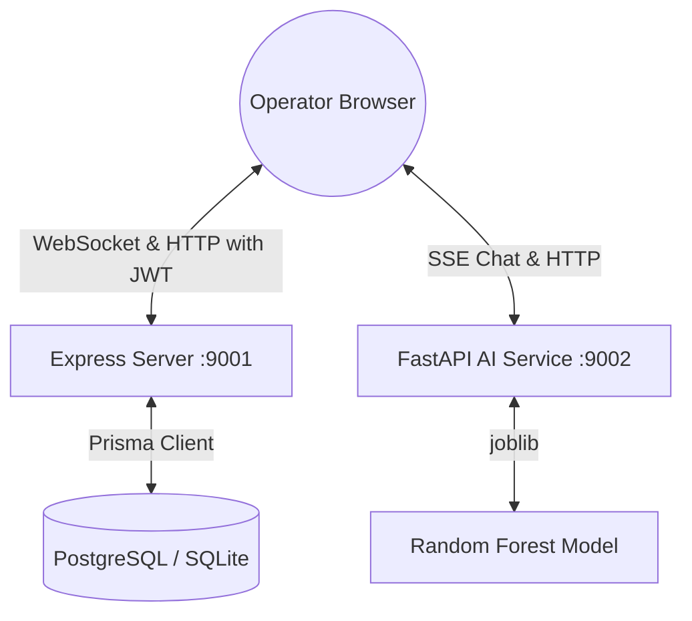

# AeroSync ✈️

**A full-stack, real-time aviation operations and cargo dispatch dashboard.**

AeroSync is an aviation control dashboard built to monitor and orchestrate active flights, coordinate cargo manifests, and simulate disruption cascade events. The platform is designed around a modern multi-tier production architecture: an Express + Socket.IO server utilizing Prisma Client (backed by PostgreSQL in production and local SQLite fallback), a FastAPI AI service running a trained Random Forest model for delay predictions and Server-Sent Events (SSE) chat streaming, and a React frontend styled with custom SpaceX-derived design tokens and animations.

---

## System Architecture



### Production Architecture (Render Multi-Service Blueprint)
In production, the application is deployed as a multi-service structure:
- **Express Backend**: Connects to a managed Render PostgreSQL database instance via Prisma. Exposes the REST API and Socket.IO server.
- **FastAPI AI Service**: Serves ML delay predictions and SSE streaming AI recovery chat recommendations.
- **Static React Frontend**: Compiled via Vite and served as a high-performance static site (statically routed to the backend and AI microservices).
- **PostgreSQL Database**: Persistent transactional storage for all operational and prediction data.

---

## Features

- **Live Operations Map**: Geospatial tracking via a dark CartoDB Leaflet map, displaying pulsing flight markers, route arcs, and active storm zones.
- **System Metrics HUD**: Displays live active flights, delayed counts, on-time percentage, cargo utilization rates, and the Passenger Impact Counter.
- **Runway Scheduling Board**: A runway timeline display mapping active flight blocks, integrating drag-and-drop slots and AI delay prediction advisories.
- **What-If Sandbox Mode**: Enables operators to enter a scheduling sandbox, adjust slots locally, and view a visual prediction diff before saving.
- **AI War Room**: Interactive recovery chat console side-by-side with a Leaflet map. Streams actionable recovery suggestions word-by-word via FastAPI SSE.
- **Disruption Simulator & D3 Cascade**: Injects operational events (weather, security, equipment) at specific hubs and calculates cascading delays, visualized on a D3 force-directed network graph.
- **Cargo Dispatch Intelligence**: Monitors manifest weights, priority status levels, and capacity limits.

---

## Project Structure

```text
aerosync/
├── ai-service/          # FastAPI AI Service (Python)
│   ├── models/          # Trained Random Forest model & features
│   ├── main.py          # FastAPI application server (Predict + SSE Chat)
│   ├── test_main.py     # python pytest suite
│   └── Dockerfile       # Python container configuration
├── backend/             # Express API & WebSocket Server (Node)
│   ├── db/              # Database configuration (Prisma client)
│   ├── middleware/      # Logger, JWT auth, and express-rate-limiters
│   ├── prisma/          # Prisma schema & database seeds
│   ├── routes/          # API Route controllers (flights, cargo, disruptions, auth)
│   ├── sockets/         # Socket.IO connection (hub-scoped room routing)
│   ├── tests/           # API integration tests using native Node test runner
│   ├── server.js        # Express application entrypoint
│   └── Dockerfile       # Node backend container configuration
├── frontend/            # React Client Application (Vite)
│   ├── src/             # Component tree, styles, providers, and state stores
│   ├── vite.config.js   # Vite configuration with chunk-splitting (ports: 9000)
│   └── Dockerfile       # Multi-stage frontend container config (Nginx)
├── docker-compose.yml   # Multi-container local orchestration spec
├── render.yaml          # Render multi-service blueprint deployment configuration
└── package.json         # Workspace configuration and workspace-wide scripts
```

---

## Security & API Hardening

- **JWT Authentication**: All mutating routes (`POST`, `PATCH`, `DELETE`) require a valid JWT bearer token. The client automatically signs in using `POST /api/auth/demo-login` on start.
- **Rate Limiting**: The `/api/disruptions/simulate` simulation injector is restricted to 5 requests per minute per IP using `express-rate-limit` to prevent denial-of-service.
- **WebSocket Scoping**: WebSocket updates are routed to hub-specific rooms (`hub:JFK`, `hub:LHR`, etc.). Changing hubs on the frontend automatically switches rooms, preventing unnecessary network traffic.

---

## API Reference

### REST Endpoints (Backend - Port 9001)

#### `POST /api/auth/demo-login`
Issues a demo JWT bearer token for local development.

#### `GET /health`
Verifies server and Prisma database connection health.
```json
{ "status": "ok", "db": "ok", "ts": "2026-06-19T09:36:55.796Z" }
```

#### `GET /api/flights`
Returns all active and scheduled flights.

#### `PATCH /api/flights/:id`
Updates gate, status, or ETA of a flight. Requires JWT token. Broadcasts to hub-scoped Socket.IO rooms.

#### `POST /api/flights/:id/predictions`
Persists an AI delay prediction in the database.

#### `POST /api/disruptions/simulate`
Simulates a cascade disruption event at an airport. Requires JWT token. Limited to 5 req/min.

---

### REST Endpoints (AI Service - Port 9002)

#### `POST /predict/delay`
Evaluates flight details against the Random Forest model and weather conditions.
- **Response**:
  ```json
  {
    "delay_probability": 0.725,
    "estimated_delay_minutes": 65,
    "confidence": 0.825,
    "reason": "high weather risk (80%) · peak travel day",
    "model_version": "rf-v1.0"
  }
  ```

#### `POST /chat`
Streams Server-Sent Events (SSE) Markdown recovery suggestions for the AI War Room.

---

## Local Setup & Run Guide

To prevent port conflicts with other projects running on ports `3000`, `3001`, or `5173`, local servers are configured to use ports **`9000` (Frontend)**, **`9001` (Backend)**, and **`9002` (AI Service)**.

### Option A: Running with Docker Compose (Recommended)
Launch the entire system (including a local PostgreSQL database container) in one command:
```bash
docker-compose up --build
```
Open [http://localhost:9000/](http://localhost:9000/) to access the live dashboard.

### Option B: Running Bare-Metal Locally

#### Step 1: Install Workspace Dependencies
From the root directory:
```bash
npm install
```

#### Step 2: Initialize Database (SQLite Fallback)
```bash
cd backend
npm install
node prisma-setup.js
npx prisma db push
npx prisma db seed
```

#### Step 3: Run the AI Service (FastAPI)
```bash
cd ai-service
pip install -r requirements.txt
BACKEND_URL=http://localhost:9000 python3 -m uvicorn main:app --host 127.0.0.1 --port 9002
```

#### Step 4: Run the Backend Server (Express)
```bash
cd backend
PORT=9001 CLIENT_URL=http://localhost:9000 node server.js
```

#### Step 5: Run the Frontend App (Vite React)
```bash
cd frontend
cp .env.example .env
npm run dev -- --port 9000
```
Open [http://localhost:9000/](http://localhost:9000/) in your browser.

---

## Running Test Suites

From the root directory:
- Run backend API integration tests:
  ```bash
  cd backend && npm run test
  ```
- Run AI service pytest suite:
  ```bash
  cd ai-service && python3 -m pytest
  ```

---

## Production Deployment (Render)

This repository contains a multi-service `render.yaml` Blueprint spec:
1. Deploys the static client onto **aerosync-frontend** (Vite build served via static hosting).
2. Provisions a managed **aerosync-db** PostgreSQL database.
3. Deploys the Express server onto **aerosync-backend** running migrations automatically via `prisma-setup.js`.
4. Deploys the Python FastAPI server onto **aerosync-ai**.

---

## License
MIT
